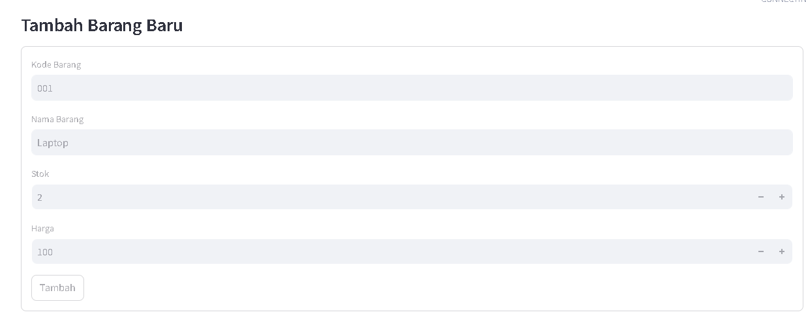

# Simple Management Inventaris Gudang

Version : 1.0

### Build with: 

- Python
- Streamlit
- Pandas
- Db SQLite

## Features
- Add new items
- Record item usage (pengurangan stok)
- Search for items by code or name
- Export inventory data to CSV

## How to Run
1. Clone the repository:
   ```
   git clone https://github.com/username/inventory-management.git
   ```

## Run the application

```
streamlit run app.py
```

### Previews





